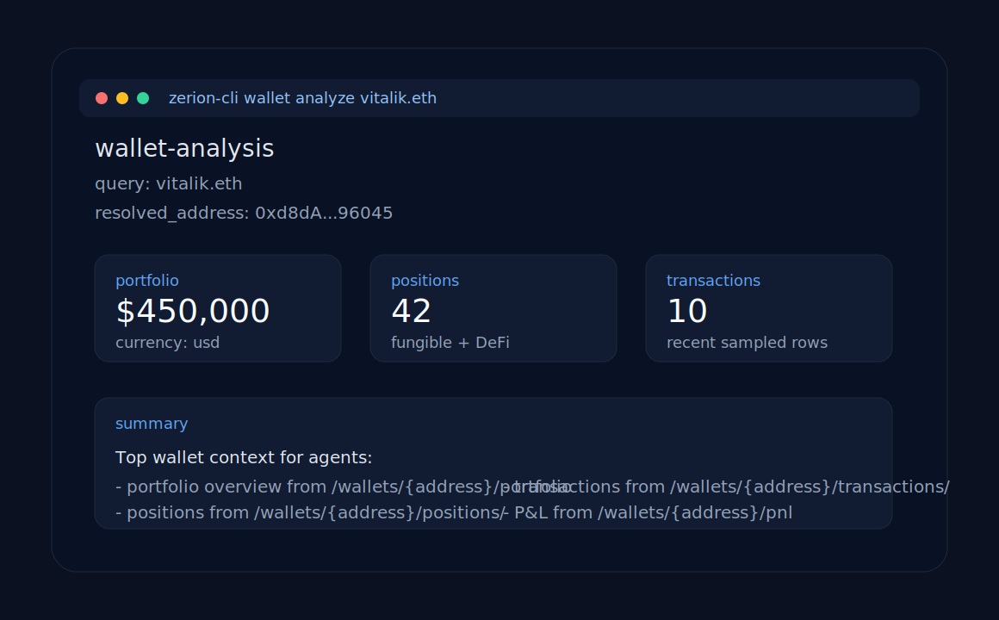

# zerion-ai

**Maintained by Zerion.**

`zerion-ai` is the public, self-contained repo for using Zerion from AI systems.

It packages two first-class integration paths:

- **Hosted MCP** for Cursor, Claude, and other MCP-native agent environments
- **`zerion-cli`** for OpenClaw-like and command-based agent runtimes

It also ships one flagship workflow:

- **`wallet-analysis`** as a reusable skill/playbook for portfolio, positions, transactions, and PnL analysis



## 1. Get your Zerion API key

Start here: [Get your API key](https://developers.zerion.io/reference/intro/authentication)

Useful current docs:

- [Build with AI](https://developers.zerion.io/reference/building-with-ai)
- [Get Wallet Data With Zerion API](https://developers.zerion.io/reference/getting-started)

As of March 8, 2026, Zerion's public authentication docs describe:

- API auth via **HTTP Basic Auth**
- dev keys beginning with `zk_dev_`
- current dev-key limits of **120 requests/minute** and **5k requests/day**

## 2. Choose your integration path

### MCP clients

Use this if your agent runtime already supports MCP.

Start here:

- [Hosted MCP quickstart](./mcp/README.md)
- [Cursor example](./examples/cursor/README.md)
- [Claude example](./examples/claude/README.md)

### OpenClaw and CLI-based agents

Use this if your framework models tools as shell commands returning JSON.

```bash
npx zerion-cli wallet analyze 0xd8dA6BF26964aF9D7eEd9e03E53415D37aA96045
```

Start here:

- [OpenClaw example](./examples/openclaw/README.md)
- [CLI usage](./cli/README.md)

## 3. Run the first wallet analysis

### MCP quickstart

1. Export your API key:

   ```bash
   export ZERION_API_KEY="zk_dev_..."
   ```

2. Add the hosted Zerion MCP config from [examples/cursor/mcp.json](./examples/cursor/mcp.json) or [examples/claude/mcp.json](./examples/claude/mcp.json)
3. Ask:

   ```text
   Analyze the wallet 0xd8dA6BF26964aF9D7eEd9e03E53415D37aA96045.
   Summarize total portfolio value, top positions, recent transactions, and PnL.
   ```

### CLI quickstart

```bash
export ZERION_API_KEY="zk_dev_..."
npx zerion-cli wallet analyze 0xd8dA6BF26964aF9D7eEd9e03E53415D37aA96045
```

Example output:

```json
{
  "wallet": {
    "query": "0xd8dA6BF26964aF9D7eEd9e03E53415D37aA96045",
    "resolvedAddress": "0xd8dA6BF26964aF9D7eEd9e03E53415D37aA96045"
  },
  "portfolio": {
    "total": 450000,
    "currency": "usd"
  },
  "positions": {
    "count": 42
  },
  "transactions": {
    "sampled": 10
  },
  "pnl": {
    "available": true
  }
}
```

## Example wallets

This repo uses the same public wallets across examples:

- `vitalik.eth` / `0xd8dA6BF26964aF9D7eEd9e03E53415D37aA96045`
- ENS DAO treasury / `0xFe89Cc7Abb2C4183683Ab71653c4cCd1b9cC194e0`
- Aave collector / `0x25F2226B597E8F9514B3F68F00F494CF4F286491`

## What ships in this repo

- [`mcp/`](./mcp/README.md): hosted Zerion MCP setup plus the wallet-analysis tool catalog this repo relies on
- [`skills/wallet-analysis/`](./skills/wallet-analysis/README.md): the flagship read-only skill
- [`cli/`](./cli/README.md): `zerion-cli` JSON-first CLI
- [`examples/`](./examples/): Cursor, Claude, OpenAI Agents SDK, raw HTTP, and OpenClaw setups

## Failure modes to expect

Both the MCP and CLI surfaces should handle:

- missing or invalid API key
- invalid wallet address
- unsupported chain filter
- empty wallets / no positions
- rate limits (`429`)
- upstream timeout or temporary unavailability

See [mcp/README.md](./mcp/README.md) and [cli/README.md](./cli/README.md) for the concrete behavior used in this repo.
